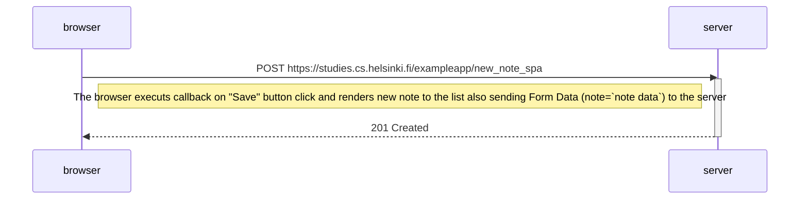

```mermaid
sequenceDiagram
participant browser
participant server

    browser->>server: POST https://studies.cs.helsinki.fi/exampleapp/new_note_spa
    activate server
    Note right of browser: The browser executs callback on "Save" button click and renders new note to the list also sending Form Data (note=`note data`) to the server
    server-->>browser: 201 Created
    deactivate server

```
